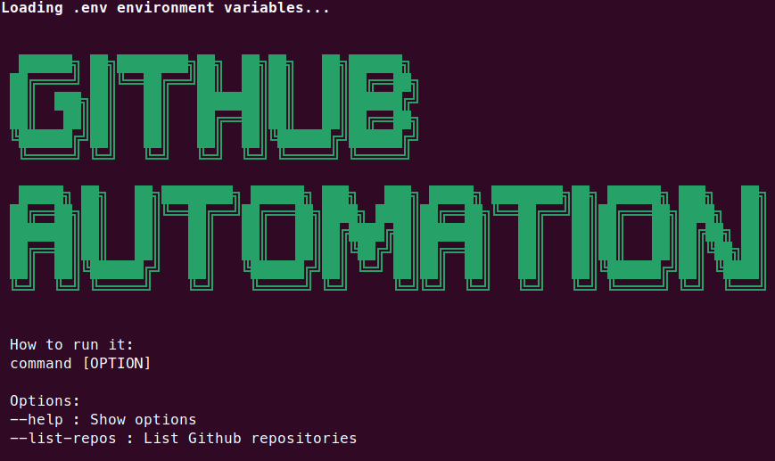

# GitHub API Automation App

Use this app in python to automate your GitHub processes



## How to use it

1. Initialize application using *Makefile*
2. Create a GitHub Personal *access token* [here](https://github.com/settings/tokens)
3. Setup **.env** file
4. Use the Makefile or set up your IDE

- Initialize **.env** file

```bash
make init
```

- Install the application

```bash
make install
```

- Run the application

```bash
make run OPTION=--your-option
```

## Using Docker

- Build the application image

```bash
make docker-build
```

- Run the application image

```bash
make docker-run OPTION=--your-option
```

## Application Options

## Notes

- To handle the GitHub REST API was used [PyGithub](https://github.com/PyGithub/PyGithub)
